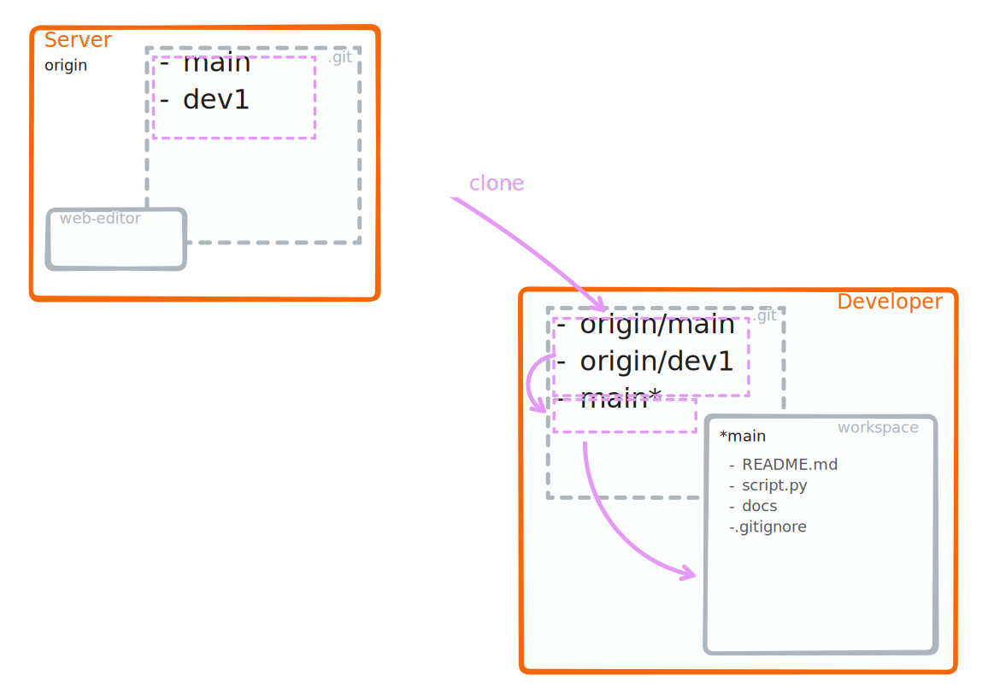


### <i class="fab fa-git"></i> <strong style="color:#ca80e9">clone</strong>





:::{card} A `git clone <url>` performs the following operations:

1. Copies the remote repository
1. Creates tracking branches for all branches on the remote repo.
1. Checks out the active branch from the remote repo.

:::

```{note}
`git clone` is run typically only once
```


