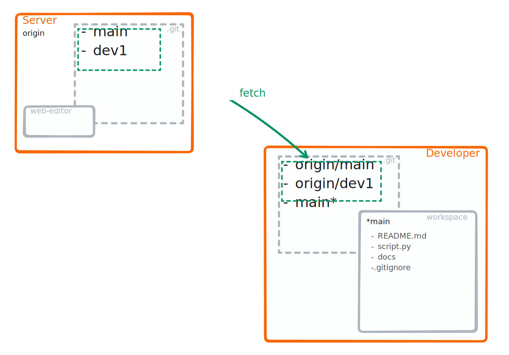

### <i class="fab fa-git"></i> <strong style="color:green">fetch</strong>

<!-- pages-include -->

:::{margin}
`git fetch` without further arguments runs:
1. Updates all remote tracking branches
::::{note}
Running `git fetch` is always a save operation
::::
:::

