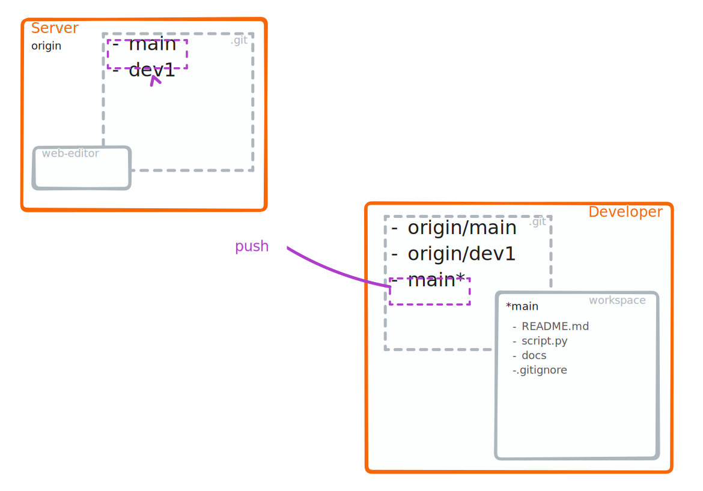


### <i class="fab fa-git"></i> <strong style="color:darkviolet">push</strong>





:::{card} Running a `git push` will:

1. Update the corresponding branch on the remote repository with the changes from the current local branch
:::

```{note}
You might encounter most hickups when doing a `git push`.
However, this is only because the remote refuses any updates that cannot be fast-forwarded[^sn1]
This operation highlights that your local branch is not up-to-date.

[^sn1]: If a new commit can be reached by following the history from another commit, then git can 'fast-forward' any reference to the new commit.
```

