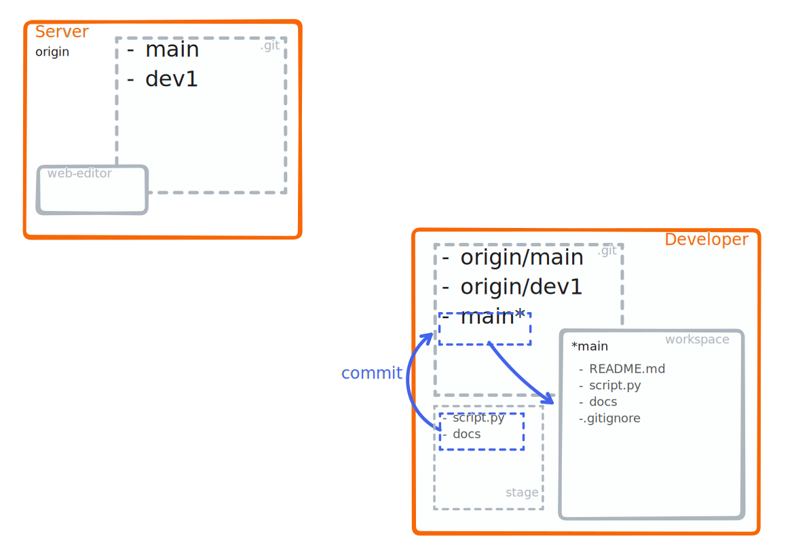

### <strong style="color:blue">commit</strong>

<!-- pages-include -->
:::{margin}
`git commit -m 'my message'` will:
1. Record all staged changes to the repository
2. Update the reference of the current branch to this last change
```{note}
- Commit messages contribute drastically to the accessibility of a repository
- If you struggle to create meaningful commit messages, consider reviewing what changes you pack into a single commit
```
:::

