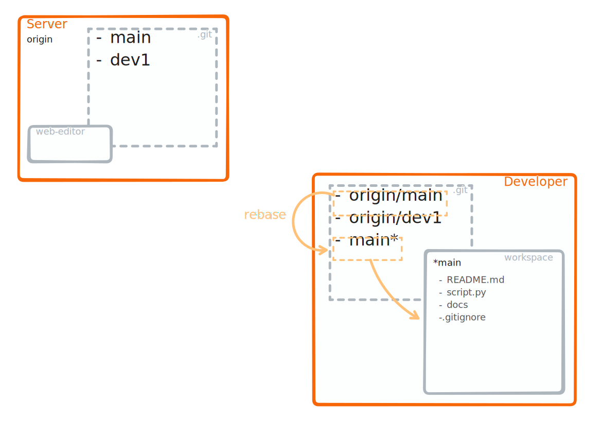

### <strong style="color:orange">rebase</strong>

<!-- pages-include -->
:::{margin}
Starting from the following setup:
```text
       C'-----D' main
      /
 A---B---C---D---E origin/main
 ```
A `git rebase` will perform:

1. Apply each commit from your local branch onto the remote branch:
   ```text
                     C''---D'' main
                    /         
   A---B---C---D---E origin/main
   ```

```{note}
- You might have to resovle conflicts for each commit from the local branch (i.e. `C'` and `D'`).
- With `git rebase -i` you can also rewrite the history of a single branch, see the [Rewriting History](https://git-scm.com/book/en/v2/Git-Tools-Rewriting-History) article on the official website.
```
:::


