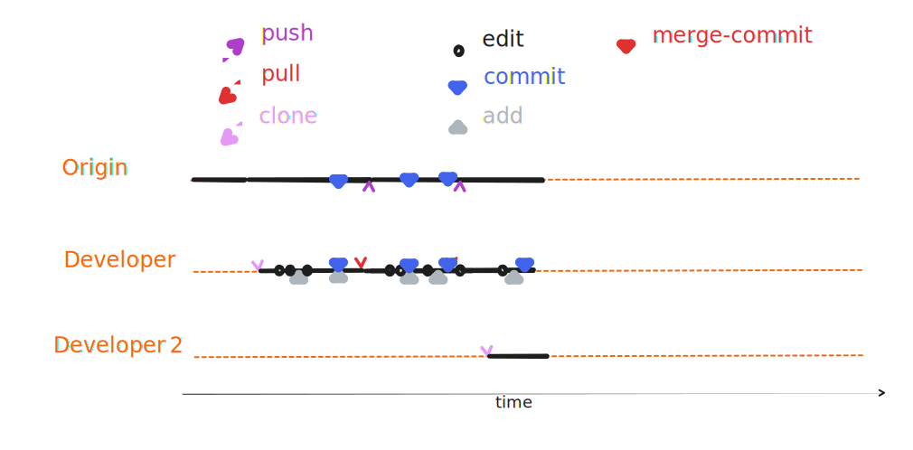
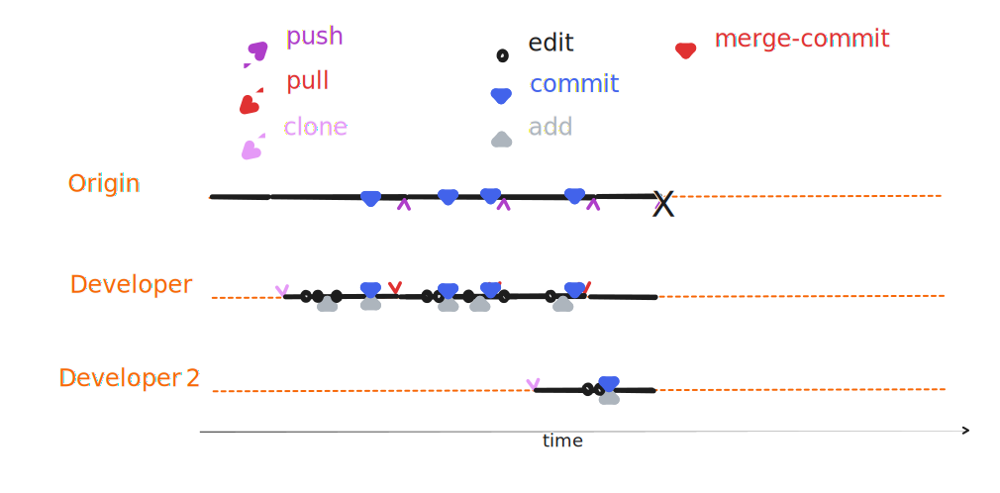
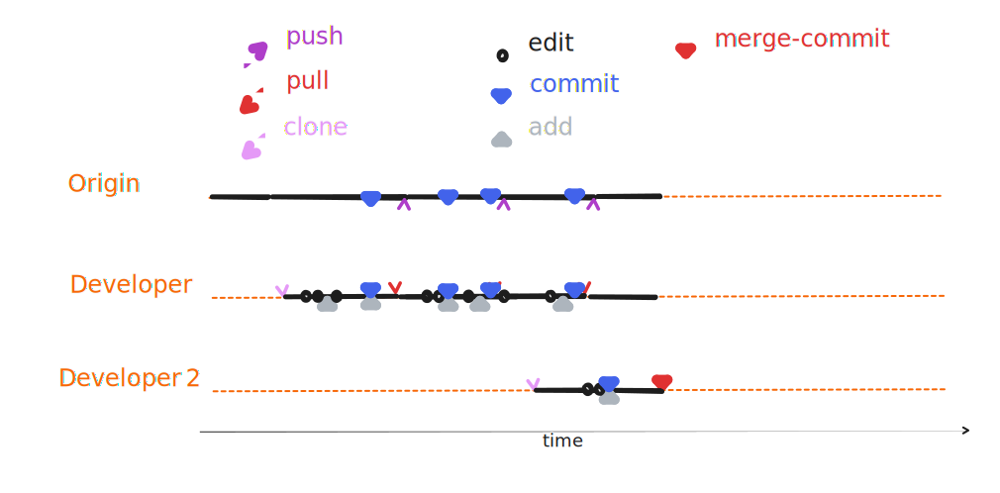
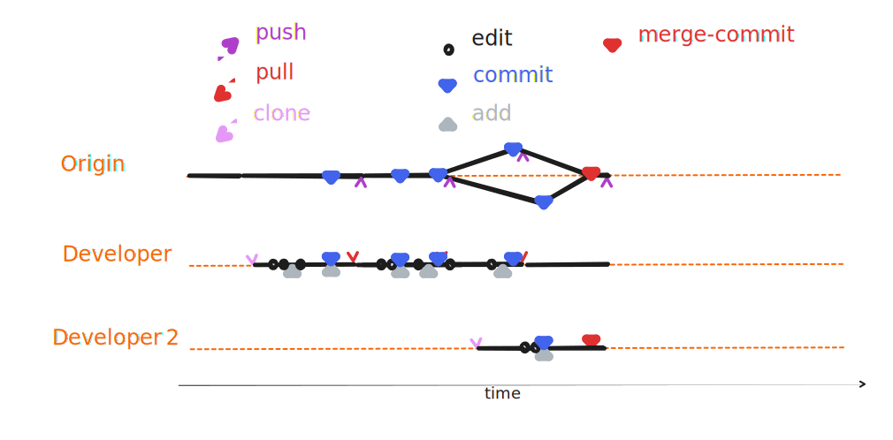

# The update cycle

Git does not automatically synchronize between devices, it is up to the developer to trigger a synchronization.

::::::{tabs}
:::::{tab} 0.1/0

:::::
:::::{tab} 0.2/0

:::::
:::::{tab} 0.3/0

:::::
:::::{tab} 1/0

:::::
:::::{tab} 2/0

:::::
:::::{tab} 2.3/0.1 

:::::
:::::{tab} 3/0.2 

:::::
:::::{tab} 3/0.3
::::{tabs}
:::{tab} merge

:::
:::{tab} rebase

:::
::::
:::::
:::::{tab} 3/1
::::{tabs}
:::{tab} merge

:::
:::{tab} rebase

:::
::::
:::::
::::::
