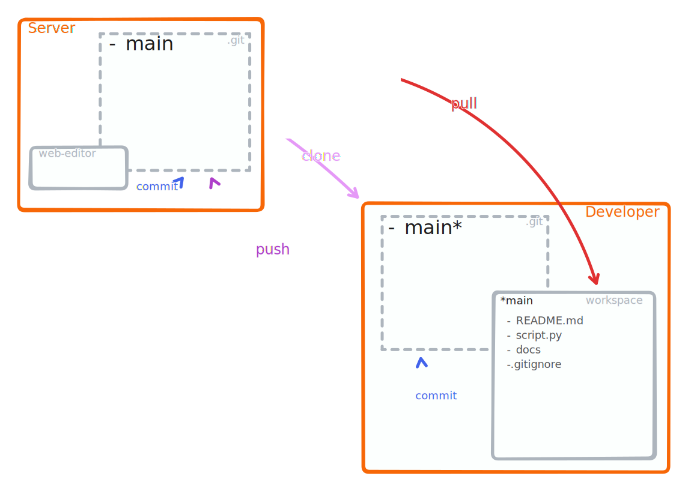

## A simplistic view

```{margin}

:::::{grid} 1
::::{grid-item}
:::{dropdown} clone &nbsp;[{octicon}`link-external;0.8em;clone`](https://git-scm.com/docs/git-clone)
:class-title: clone 
Get changes from a remote repository.
:::
::::
::::{grid-item}
:::{dropdown} pull &nbsp;[{octicon}`link-external;0.8em;pull`](https://git-scm.com/docs/git-pull)
:class-title: pull
Get changes from a remote repository.
:::
::::
::::{grid-item}
:::{dropdown} add &nbsp;[{octicon}`link-external;0.8em;add`](https://git-scm.com/docs/git-add)
:class-title: add
Add file contents to the index (staging area) to collect changes for the next commit.
:::
::::
::::{grid-item}
:::{dropdown} commit &nbsp;[{octicon}`link-external;0.8em;commit`](https://git-scm.com/docs/git-commit)
:class-title: commit
Record modifications to add to the history.
:::
::::
::::{grid-item}
:::{dropdown} push &nbsp;[{octicon}`link-external;0.8em;push`](https://git-scm.com/docs/git-push)
:class-title: push
Push the changes back to the remote repository.
:::
::::
:::::
```


