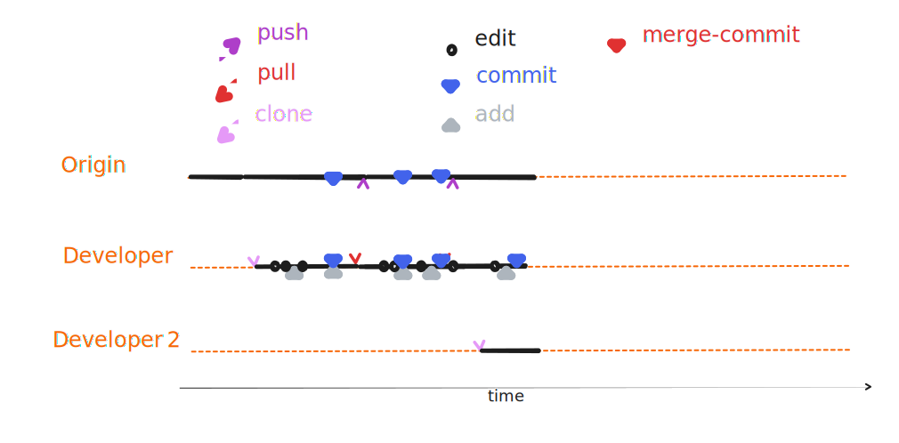


###  2.3{octicon}`sync;0.8em`/ 0.1{octicon}`sync;0.8em`



::::{margin}



:::{card} Developer 1
- several changes added
- created a <i class="fas fa-code-commit"></i> commit
:::
:::{card}  Developer 2
- checks out the repository
:::

::::


