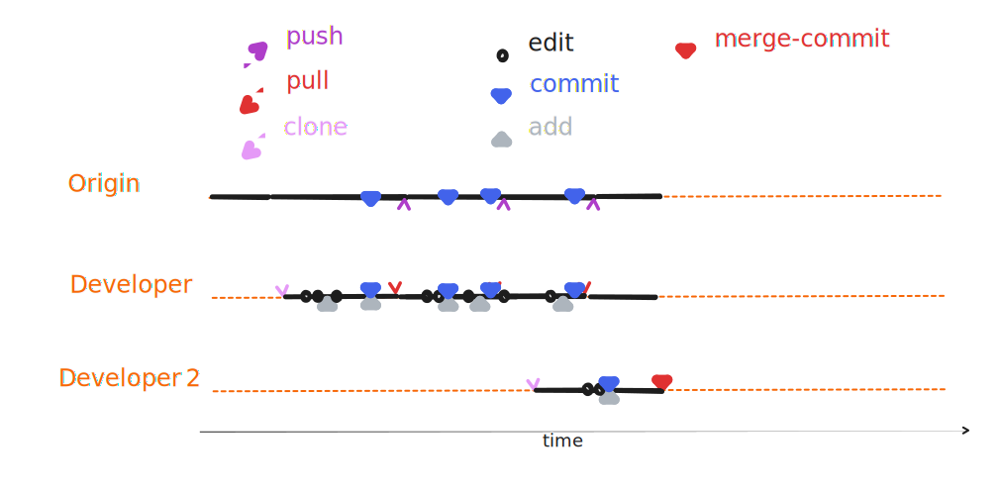


###  3{octicon}`sync;0.8em`/ 0.3{octicon}`sync;0.8em` - `merge`



::::{margin}



:::{card} 😴 Developer 1 😴
:::
:::{card} Developer 2
- merges the state from `origin` into the local branch
:::

::::


