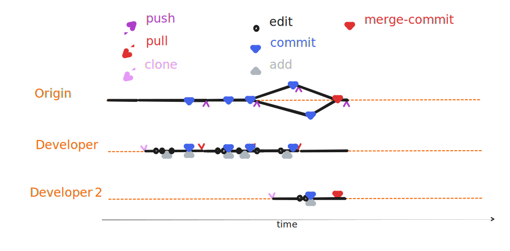


###  3{octicon}`sync;0.8em`/ 1{octicon}`sync;0.8em` - `merge`



::::{margin}



:::{card} 😴 Developer 1 😴
:::
:::{card} Developer 2
- pushes local merge commit to `origin`, completing the 1st update cycle
:::

::::


