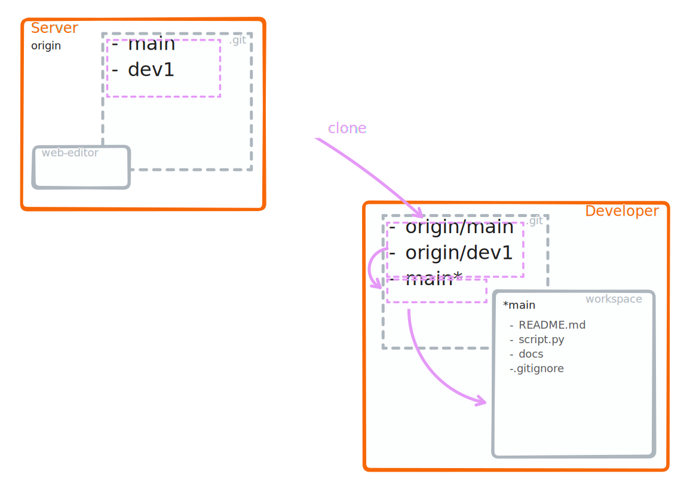
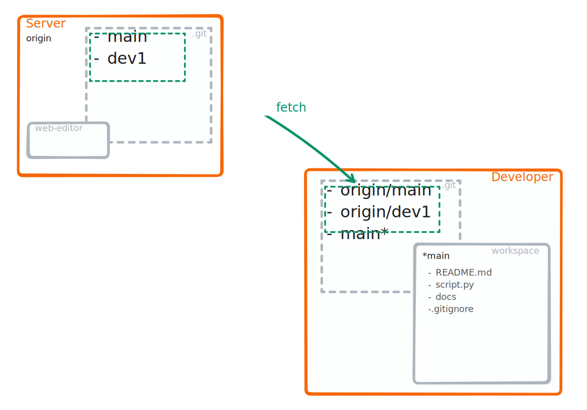
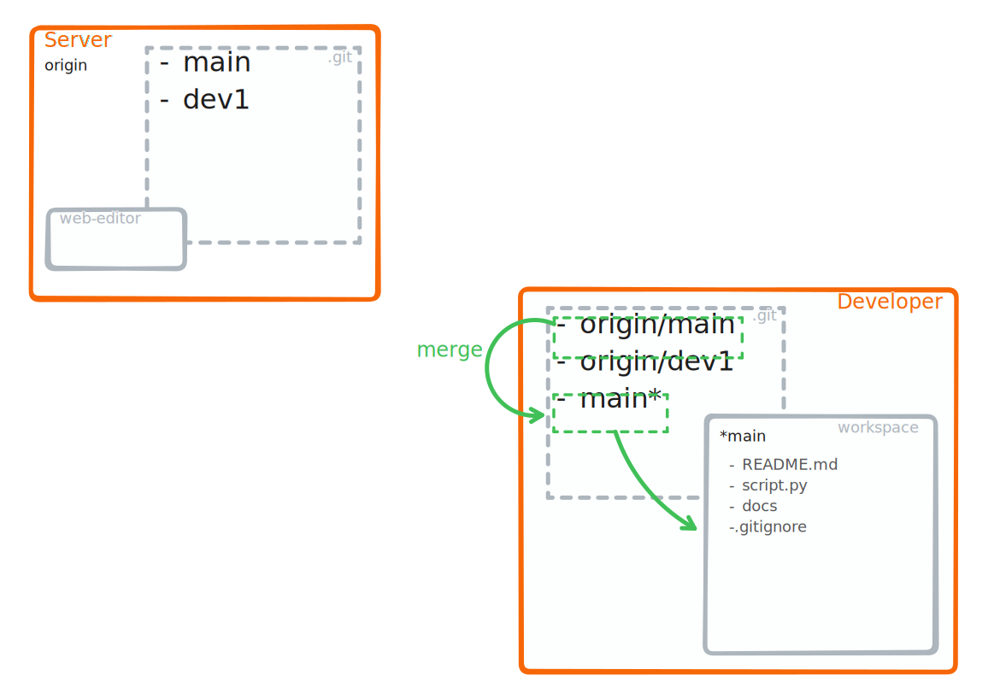
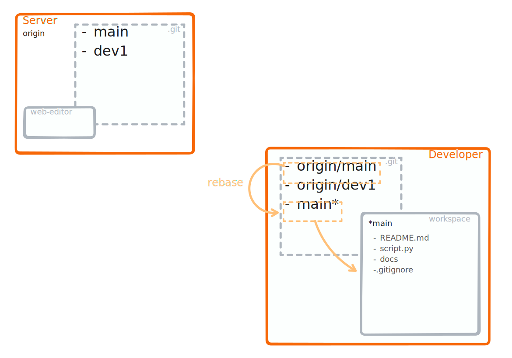
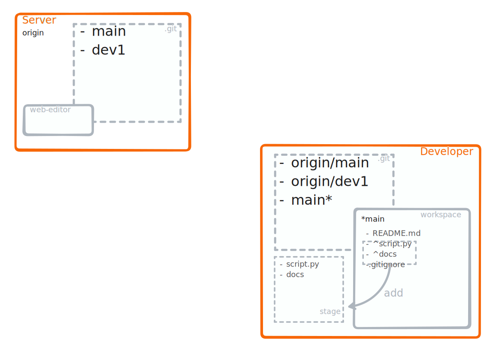
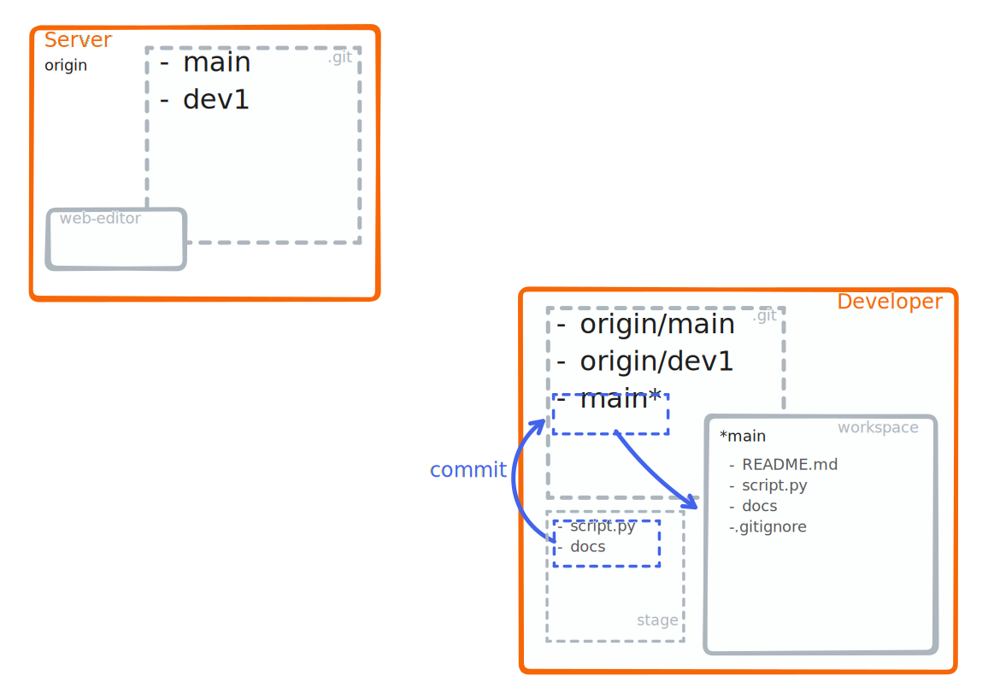
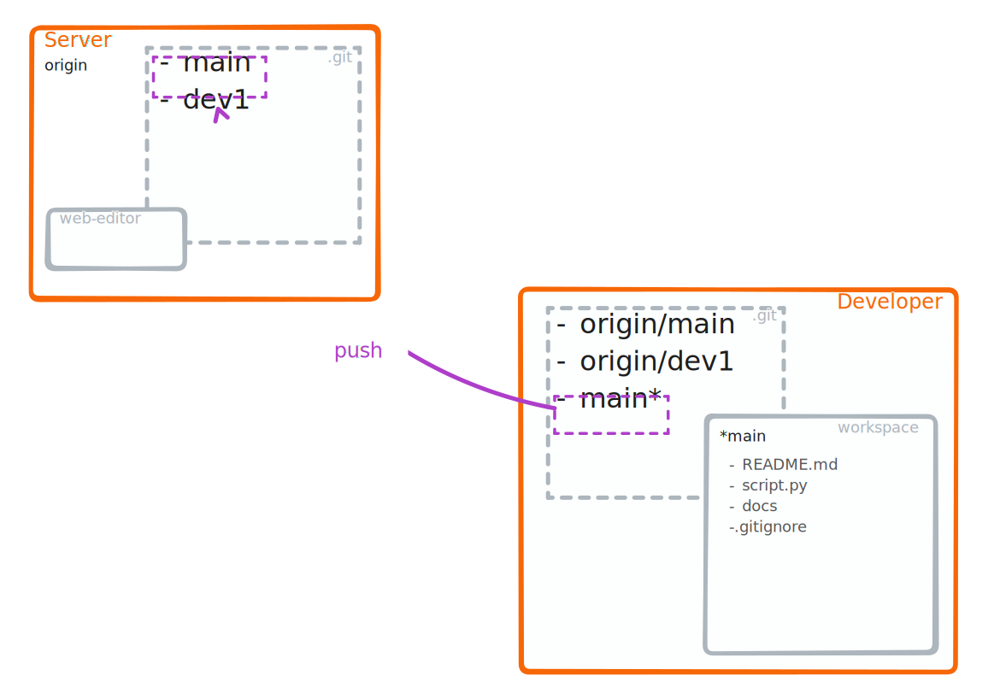

# Elementary commands 

::::{tabs}

:::{tab} <strong style="color:#ca80e9">clone &nbsp;[{octicon}`link-external;0.8em;clone`](https://git-scm.com/docs/git-clone)</strong>

A `git clone <url>` performs the following operations:
1. Copies the remote repository
1. Creates tracking branches for all branches on the remote repo.
1. Checks out the active branch from the remote repo.
```{note}
`git clone` is run typically only once
```
:::

:::{tab} <strong style="color:green">fetch &nbsp;[{octicon}`link-external;0.8em;fetch`](https://git-scm.com/docs/git-fetch)</strong>

`git fetch` without further arguments runs:
1. Updates all remote tracking branches
```{note}
Running `git fetch` is always a save operation
```
:::

:::{tab} <strong style="color:lightgreen">merge&nbsp;[{octicon}`link-external;0.8em;merge`](https://git-scm.com/docs/git-merge)</strong>

Starting from the following setup:
```text
       C'-----D' master
      /
 A---B---C---D---E origin/master
 ```
A `git merge` will perform:

1. Create a new commit on top of the current branch that contains all the changes from the commits from **origin/master**
   ```text
                 master 
                 ∨
          C'-----D'---F
         /           /
    A---B---C---D---E origin/master
   ```
1. Set the head of your local branch to this new commit
   ```text
          C'-----D'---F master
         /           /
    A---B---C---D---E origin/master
    ```
```{note}
If your current branch is **master**, a `git merge` will be equivalent to `git merge origin/master`.
```
:::

:::{tab} <strong style="color:orange">rebase&nbsp;[{octicon}`link-external;0.8em;rebase`](https://git-scm.com/docs/git-rebase)</strong>


Starting from the following setup:
```text
       C'-----D' master
      /
 A---B---C---D---E origin/master
 ```
A `git rebase` will perform:

1. Apply each commit from your local branch onto the remote branch:
   ```text
                     C''---D'' master
                    /         
   A---B---C---D---E origin/master
   ```

```{note}
- You might have to resovle conflicts for each commit from the local branch (i.e. `C'` and `D'`).
- With `git rebase -i` you can also rewrite the history of a single branch, see the [Rewriting History](https://git-scm.com/book/en/v2/Git-Tools-Rewriting-History) article on the official website.
```
:::

:::{tab} <strong style="color:gray">add &nbsp;[{octicon}`link-external;0.8em;add`](https://git-scm.com/docs/git-add)</strong>

Running `git add .` will:
1. Register all changes in the current content of your workspace (mind the `.`!) with respect to the current branch. This is also called "staging".

```{note}
- `git rm` is **not** the counterpart of `git add` as it removes a file from the tracking and even from the workspace (unless you use `--cached`).
- "unstageing" changes in a file can be done with `git restore --stage <pat-to-file>` (see [<strong style="color:gray">restore &nbsp;{octicon}`link-external;0.8em;add`</strong>](https://git-scm.com/docs/git-restore) for details)
```
:::

:::{tab} <strong style="color:blue">commit &nbsp;[{octicon}`link-external;0.8em;commit`](https://git-scm.com/docs/git-commit)</strong>

`git commit -m 'my message'` will:
1. Record all staged changes to the repository
2. Update the reference of the current branch to this last change
```{note}
- Commit messages contribute drastically to the accessibility of a repository
- If you struggle to create meaningful commit messages, consider reviewing what changes you pack into a single commit
```
:::

:::{tab} <strong style="color:darkviolet">push &nbsp;[{octicon}`link-external;0.8em;push`](https://git-scm.com/docs/git-push)</strong>

A `git push` will:
1. Update the corresponding branch on the remote repository with the changes from the current local branch
```{note}
You might encounter most hickups when doing a `git push`.
However, this is only because the remote refuses any updates that cannot be fast-forwarded[^sn1]
operation is only where it becomes apparent that you local branch was not updated.

[^sn1]: If a new commit can be reached by following the history from another commit, then git can 'fast-forward' any reference to the new commit.
```

:::

::::

::::{dropdown} pull &nbsp;[{octicon}`link-external;0.8em;pull`](https://git-scm.com/docs/git-pull)
:class-title: pull
Assuming this is the state in which you run a `git pull`:
```text
      C---D---E master on origin
     /
A---B---C'---D' master
    ^
    origin/master in your repository
```
What will happen:

1. `git fetch` will update **origin/master**
   ```text
                   origin/master in your repository
                   ∨
          C---D----E master on origin
         /
    A---B---C'---D' master
   ```
2. `git merge origin/master` will
  
   - replay the commit from the remote branch (`C`, `D` and `E`) at the end of your local **master**, i.e. on top of `D'`
   - register the result in a new commit `F` on top of your local branch, i.e. **master** in this case
   ```text
                   origin/master in your repository
                   ∨
          C---D----E master on origin
         /          \
    A---B---C'---D'--F master
   ```
::::
