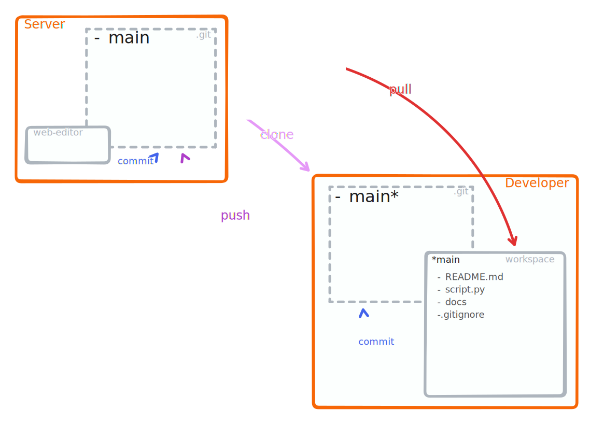

# Getting started

All you need to know to perform a basic update cycle with git are 4+1 commands[^sn1]:

:::::{grid} 1 4 4 4
::::{grid-item}
:::{dropdown} clone &nbsp;[{octicon}`link-external;0.8em;clone`](https://git-scm.com/docs/git-clone)
:class-title: clone 
Clone a repository into a new directory.
:::
::::
::::{grid-item}
:::{dropdown} pull &nbsp;[{octicon}`link-external;0.8em;pull`](https://git-scm.com/docs/git-pull)
:class-title: pull
Get changes from a remote repository.
:::
::::
::::{grid-item}
:::{dropdown} add &nbsp;[{octicon}`link-external;0.8em;add`](https://git-scm.com/docs/git-add)
:class-title: add
Add file contents to the index (staging area) to collect changes for the next commit [^sn2].
:::
::::
::::{grid-item}
:::{dropdown} commit &nbsp;[{octicon}`link-external;0.8em;commit`](https://git-scm.com/docs/git-commit)
:class-title: commit
Record modifications to add to the history.
:::
::::
::::{grid-item}
:::{dropdown} push &nbsp;[{octicon}`link-external;0.8em;push`](https://git-scm.com/docs/git-push)
:class-title: push
Push the changes back to the remote repository.
:::
::::
:::::
[^sn1]: All you _need_ is not necessarily all you _should_ use!
[^sn2]: Adding is not mandatory, but it is a good practice to keep track of changes. It can be done in a single step with `git commit -a`.

## A simplistic view

## Gotchas

:::::{card} git pull&nbsp;[{octicon}`link-external;0.8em`](https://git-scm.com/docs/git-pull) are actually 2 commands:

::::{card} git fetch &nbsp;[{octicon}`link-external;0.8em`](https://git-scm.com/docs/git-fetch)
Downloads the last status of a repository from the remote.
::::
_followed by_
::::{card} git merge&nbsp;[{octicon}`link-external;0.8em`](https://git-scm.com/docs/git-fetch) _or_ git rebase &nbsp;[{octicon}`link-external;0.8em`](https://git-scm.com/docs/git-rebase) 

Incorporate changes from another branch into the current branch.
:::{dropdown} {octicon}`info`&nbsp;Decide which option to use
:color: info

- You can specify what option you want with `--rebase=true|false|...`
  
  Example:

      git pull --rebase=true

- You can set in the configuration which strategy to use:

      git config pull.rebase true

  or globally:

      git config --global pull.rebase true
:::
::::
:::::
:::::{card} The git update cycle is not your work cycle
Whenever you want to update the remote repository you need to perform a full git cycle, including a **`git pull`**.
:::::
